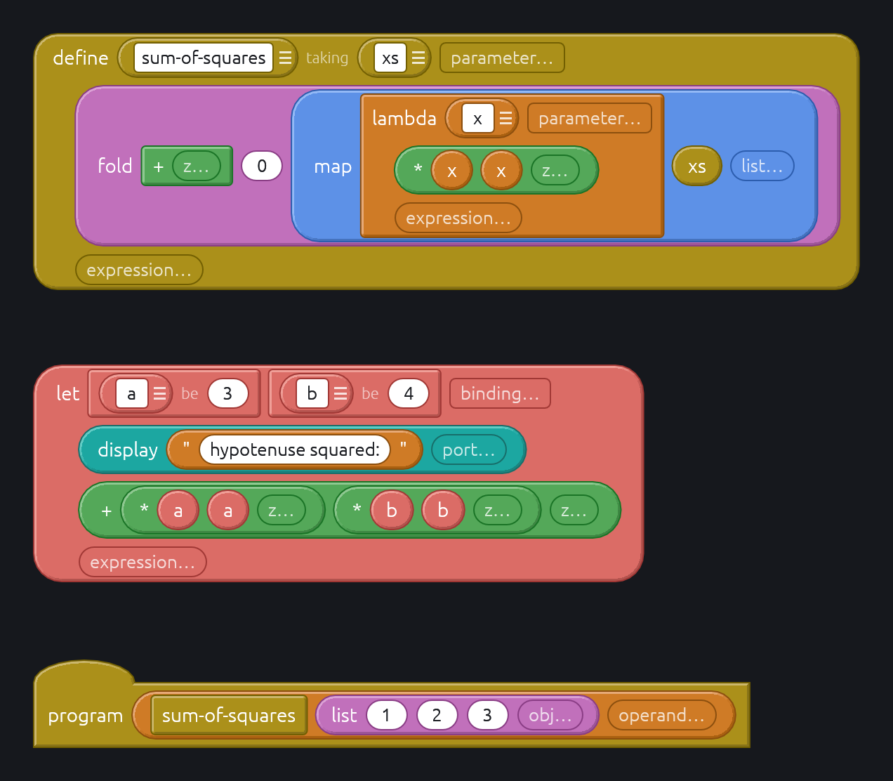
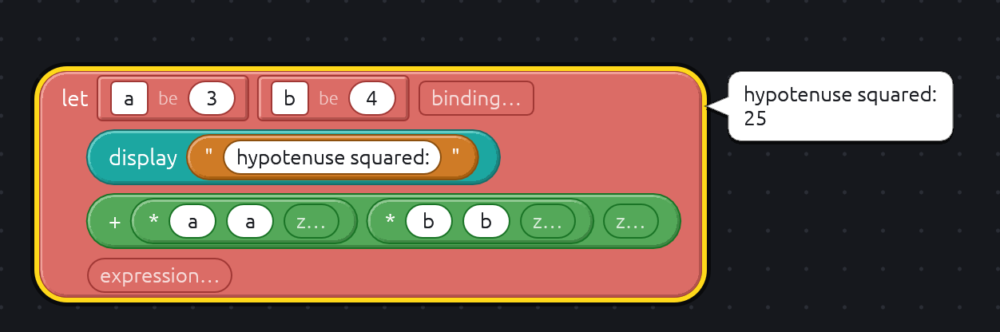

# Block Schemer

Block Schemer is a visual block-based programming environment much like [Scratch](https://scratch.mit.edu),
that provides blocks to program in Scheme. The current Scheme interpreter is [Steel](https://github.com/mattwparas/steel), though that may change in the future.
Steel is currently mostly r5rs-compliant, and is working toward r7rs compliance.

## Releases

Builds are on the [Releases](https://github.com/Zanderwohl/block-parse/releases) page:

- **macOS**: a `.dmg` holding the app for both Apple Silicon and Intel. It is not notarized, so the first time,
  right-click the app and choose Open, or run `xattr -dr com.apple.quarantine "/Applications/Block Schemer.app"`.
- **Windows**: a `.zip` holding `block-schemer.exe`. SmartScreen may warn, since it is not signed.
- **Linux**: an `.AppImage` (`chmod +x` and run it), or a `.tar.gz` with the bare binary, a desktop entry and an icon.

To make a release, run the **Release** workflow from the Actions tab with a tag such as `v0.1.0`. It builds every
platform and attaches the builds to a draft release to look over and publish.

## Compiling Block Schemer

1. Install rust using [rustup](https://rustup.rs/). This will include cargo, rust's toolchain.
   1. You will also need a C compiler & linker, which is platform-dependant.
2. Install cargo-bundle `cargo install cargo-bundle`
3. Compile
   1. For dev `cargo schemer` will run Block Schemer

You can run an example with `cargo schemer crates/block-schemer/examples/sum-of-squares.scmb`

## Bundle Block Schemer as a macOS app

1. Set up for development (above)
2. Install cargo-bundle `cargo install cargo-bundle`
3. Bundle `cargo bundle -p block-schemer --release`
   1. It is compiled to `target/release/bundle/osx/Block\ Schemer.app`.

## Credit and Attribution

Naturally, this project is heavily indebted to Scratch, which popularized educational coding for multiple generations.

Steel is licensed under the MIT license.

### Icons

Icons are derived from [Public Domain Lisp Logo Set](https://www.lisperati.com/logo.html) by Conrad Barski.
