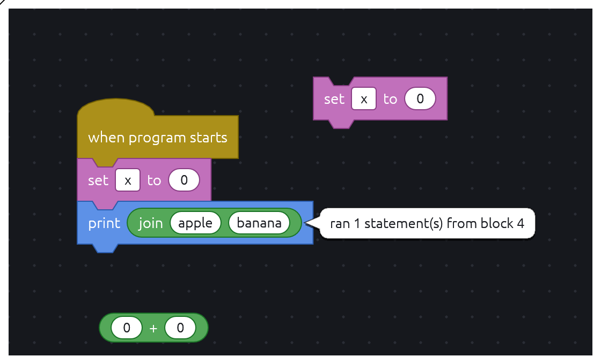
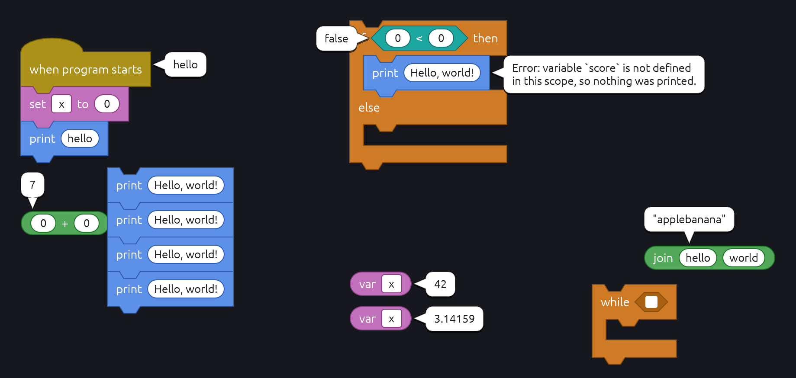

# Running a block and speech bubbles

The editor runs nothing. Double-clicking a block asks the host to run it, and
whatever the host has to say back shows in a speech bubble beside the block.

## Asking to run

A second click on the same block, within egui's double-click delay
(`InputOptions::max_double_click_delay`, 0.3 s by default), sends
`EditorEvent::Run { block, script }`. Both clicks also send `BlockClicked`, so a
host that selects on click has selected the block by the time it runs.

The editor counts clicks itself rather than asking egui for a double-click: egui
counts a double-click that comes soon after an earlier one as a triple click, so
running a block twice in a row would sometimes do nothing.

Running works in read-only mode, like switches: it changes nothing in the
program. A click on a literal field belongs to the field and does not count.

`script` is `Program::script_at(language, block)`, built the way
`Program::ast` builds a stack:

| Double-clicked                    | `script.body`                                    |
| --------------------------------- | ------------------------------------------------ |
| A hat                             | Its whole script                                 |
| A statement                       | It and every block below it, as a drag takes them |
| A reporter, loose or in a slot    | That one expression                              |

Faults inside it are `Problem` nodes, as in any AST; whether to run around them
is the host's call. A host implementing `Runner` gets the same request through
`Runner::run_block(program, block, script)`.

## Answering

The host answers through its `Overlay`: `bubbles: HashMap<BlockId, String>`
maps a block to the text beside it. Like everything else in the overlay, the
editor keeps none of it; a bubble stays as long as the host keeps passing it
and goes when the host drops it.

While a run is pending or its bubble shows, the host marks the block with a
`Highlight` of style `HighlightStyle::Dispatched`, which the theme draws as a
yellow outline (`Theme::dispatched`). The editor does not add it itself: only
the host knows when a run is done with.

The editor binary has no backend yet: it answers each run with "No backend
configured." and outlines the block, and drops both on any click or edit.

## Placement

Text wraps at 220 canvas units. The bubble points at the block's first row (so
a hat's points at its label, not the empty space beside its curve) and keeps off
the whole block.

`bubble::place` scores sixteen spots around that row: three alignments on each
side (start, center, end) and the four diagonals, which sit closer in so their
tails are no longer than the rest. The lowest score wins:

1. Covering its own block costs a thousand times its area, so it happens only
   when nothing else is possible.
2. Area outside the visible canvas costs four times its area: a bubble cut off
   cannot be read.
3. Area over other blocks' rows, and over bubbles already placed, costs its
   area. Bubbles are placed in draw order, so later ones move around earlier
   ones.
4. Ties go in order: right, above, below, left.

The bubble is drawn in front of the blocks and their fields, and under an open
choice menu and a run in hand.

## The tail

The tail runs from the point on the bubble's edge nearest the block to the point
on the block nearest that:

1. The side it leaves from faces the block along the axis with the wider gap.
2. Along that side it sits midway along the span shared with the block or,
   with none shared, at the end nearest it, kept clear of the rounded corners.
3. The tip is the nearest point of the block's row to that anchor, pulled back
   two units so it does not touch.

The base stays on the straight side while the tip goes wherever the block is,
so a diagonal bubble gets a slanted tail. The outline is the rounded rectangle
with the triangle spliced into that side; the fill is two convex pieces, the
body and the triangle.

## Limits

- Bubbles take no clicks: a click on one reaches the block underneath.
- Covering a label counts the same as covering any other part of a block, so
  in a crowded spot a bubble may hide a word of a neighbor.
- In `snapshot::program` the visible area is the program's bounds plus the
  margin; a bubble that cannot fit there grows the image.
