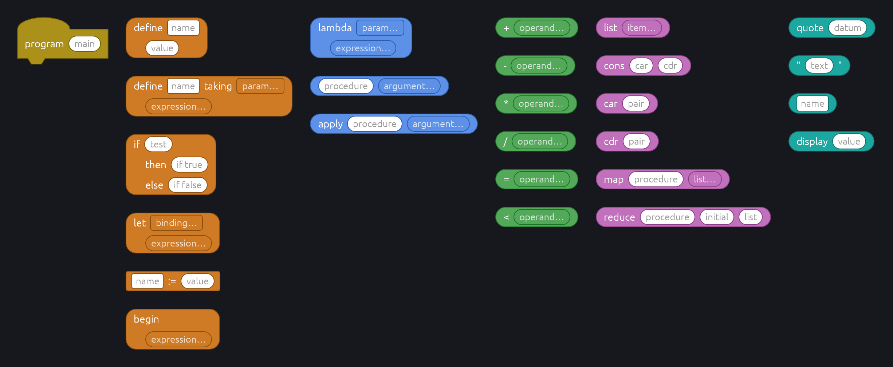
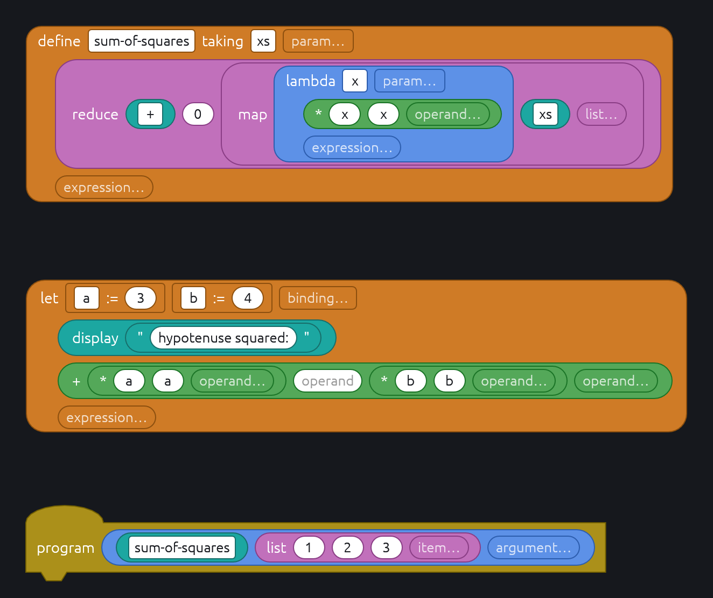

# Variadic inputs and block layout

A block can take any number of reporters in one input, such as Scheme's
`(+ 1 2 3)` or the body of a `lambda`. Such an input is a list. Lists that grow
downward need blocks laid out over several rows, so this note also covers
`layout`.

Old programs and language files are not kept working: the format changes where
that is simpler.

## Spec

`{name:type*}` is a list of any length and `{name:type+}` a list of at least
one item. A block may have several, anywhere in its spec:

```ron
(id: "call",   kind: Reporter("datum"), spec: "{f:datum} {args:datum*}"),
(id: "minus",  kind: Reporter("datum"), spec: "- {args:datum+}"),
(id: "let",    kind: Reporter("datum"), spec: "let {bindings:binding*} {body:datum+}", layout: Body(1)),
```

`*` and `+` join `{ } [ ] : =` as characters type names may not contain. A list
takes no default: it starts empty, so a list from the palette is just its empty
slot. Every item has the list's type, and an item takes reporters and literals
exactly as a single input of that type would.

## Program

`Block` gains `lists: BTreeMap<String, Vec<Input>>` beside `inputs`. Names are
unique across a spec, so the two maps never share a key.

An item that holds neither a reporter nor a literal (`Input::default()`) is a
hole. Holes inside a list stay where they are: without inserting between items
(below), closing a gap would move the items after it. Holes at the end are
dropped after every edit and on load, so a list never ends in one.

Loading is tolerant, as for inputs: a list the block does not define is kept
and reported as `UnknownInput`, and so is a list stored under a single input's
name or the other way round.

## Editing

The empty slot after a list's last item is drawn by the GUI and never stored.
Dropping a reporter on it, or typing into it, appends an item. For a `Bool` or
`Choice` type it takes drops only; ticking or choosing into it is not done
yet.

Slots are addressed by name and, in a list, index:

```rust
pub struct Slot {
    pub input: String,
    /// `None` for a single input.
    pub item: Option<usize>,
}
```

`Target::Input { parent, slot }`, `Location::Input`, `AttachError::NoSuchInput`,
`Program::set_literal(block, &Slot, text)`, `Block::slot` and
`Problem::slot: Option<(BlockId, Slot)>` all take it. A target's index may equal
the list's length, meaning the empty slot; any larger is `NoSuchInput`.
`Block::list_len(list, lifted)` is that length once a lifted reporter is out
of the list, so a drag sees the list as it will be: lifting the last item
leaves a trailing hole, which does not count.

- Dropping on an item ejects the reporter already there, as on a single input.
- Dragging a reporter out of an item leaves the item's literal, or a hole if it
  had none; trailing holes then go.
- Emptying a list item's text makes it a hole at once, so clearing the last
  item removes it. The empty slot and the item typing into it creates share an
  address, so the field keeps focus as the item comes and goes. An empty
  string is a literal like any other only in a single input; in a list it
  must come from a reporter or a validator that reads quotes.
- Depth counts list items as it counts inputs.

Until inserting between items and closing holes arrive (see Deferred),
rearranging means dragging items out and back in.

## AST

```rust
pub struct Node {
    pub id: BlockId,
    pub opcode: String,
    pub args: Vec<Arg>,
    /// Spec order.
    pub lists: Vec<List>,
    pub branches: Vec<Branch>,
}

pub struct List {
    pub name: String,
    /// Holes are `Expr::Problem` with `MissingInput`, so indices match the program.
    pub items: Vec<Expr>,
}
```

`Node::list(name) -> Option<&[Expr]>` sits beside `arg` and `branch`. A `+` list
with no items is a `TooFewItems` error on its block, with the node kept in
`recovered`. A list the block does not define keeps its items as
`UnknownInput` warnings, each with its reporter recovered.

## Layout

`BlockConfig` gains `layout`, `Inline` by default:

- `Inline` lays a reporter out in one row, as now; a list's items and its empty
  slot follow each other in that row.
- `Body(n)` keeps the first `n` inputs on the first row, a list counting as
  one input with all its items. Each later input gets an indented row of its
  own, and so does each item of a later list, its empty slot included. A label
  goes on the row of the input it comes before, so
  `if {c:datum} then {t:datum} else {e:datum}` with `Body(1)` reads
  `if c` / `then t` / `else e`. Labels before the first input always head the
  block, so `begin {body:datum+}` with `Body(0)` reads `begin` above its
  items. Labels after the last input share its row.

This follows Emacs's `lisp-indent-function`: `define` and `lambda` are
`Body(1)`, so `lambda {params:symbol*} {body:datum+}` keeps its parameters
beside its name and lists its body below; calls are `Inline`. It is per block, not per use, so the programmer
cannot choose where lines break; in return a program always reads the same.

`Body` is allowed on any block without branches; a block with branches already
has rows of its own. A hat such as `program {forms:datum*}` with `Body(0)`
lists one top-level form per row.

A reporter of several rows keeps its shape at the first row's height: `Round`
becomes a rectangle whose corners have the radius a one-row reporter's ends
would, and `Hexagon` keeps its points beside the first row, with straight sides
below and its bottom corners cut at the same angle. Both stay convex. The ends
stop growing at `MAX_END` (40 units), so a one-row block holding a tall one
does not swell into a huge pill.

## Hints

A blank slot shows a hint in gray: the input's name, or free text from the
block's `hints`, keyed by input or list name:

```ron
(id: "add", kind: Reporter("datum"), spec: "+ {args:datum*}", hints: {"args": "operand"}),
```

A slot is blank when it holds no reporter and, for a typed literal, no text;
checkboxes and choices are never blank. Every hole in a list shows the list's
hint, and its empty slot shows it followed by `…`, drawn as an outline in the
type's shape. A blank slot is sized to fit its hint, so it does not shrink to
nothing. The hint is painted under a live field rather than as egui's hint
text, which forces its own color.





## Deferred

- **Closing holes.** Dragging the last thing out of an item, or clearing its
  field, would remove the item and close the gap rather than leave a hole.
  Waits on inserting between items, so that a gap can be closed without
  losing the way to put an item back where it was. Holes, and `MissingInput`
  for them, would then only come from loading.
- **Inserting between items.** A drop target in the gap between two items, and
  before the first, that inserts rather than replaces: `Target::Input` with an
  `insert: bool`, or its own target. Items after it shift, so the GUI must
  move any focused field and in-flight edit along with them.
