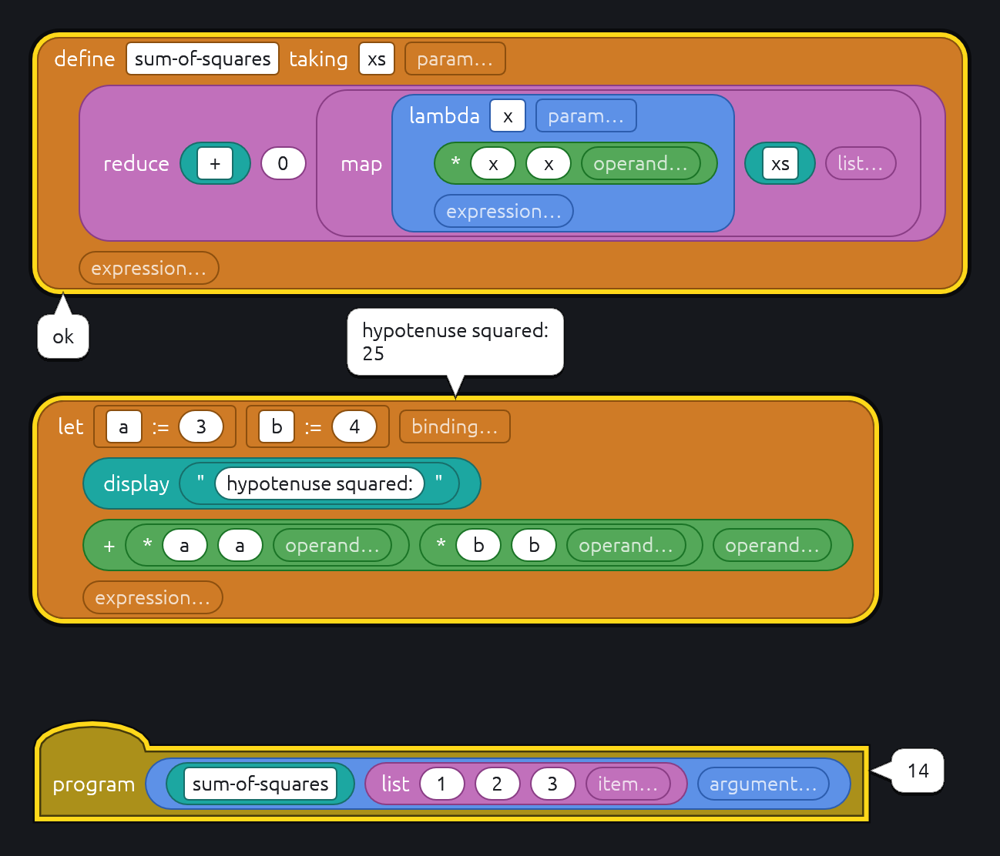

# Block Schemer

`crates/block-schemer` is a consumer of block-parse: a block editor for
R7RS Scheme's standard procedures and a few of its forms, whose blocks run
when double-clicked. It is the
template for a host: a language file, validators, a `Runner`, and a `main`
that hands them to `block_parse_gui::app::run`.

```sh
cargo schemer                                              # a new program
cargo schemer crates/block-schemer/examples/sum-of-squares.scmb
cargo schemer-snapshot crates/block-schemer/examples/factorial.scmb factorial.png  # an image, no window
```



## Pieces

- `scheme.ron`: the language, embedded with `include_str!` so the binary
  needs no files beside it. Programs are `.scmb`. Opcodes are Scheme's own
  names, so most blocks generate `(opcode arguments…)` in spec order.
  Categories are R7RS's section titles, plus CxR for the 24 three- and
  four-level `c…r`s, and inputs its argument names (`proc`, `formals`, `z`),
  except `cons`, whose inputs are `car` and `cdr`. Optional arguments are a
  list after the required ones, its hint naming them (`start, end…`); a list
  has no maximum, so too many fail when run. Connecting words that are not
  Scheme, such as `if`'s `then` and `else`, are faint. `fold` is SRFI 1's,
  with its names, filed under Pairs and lists; Steel's takes one list.
  Every block is tagged `basics` if it is among the most used, and with the
  library it comes from, `char` for `(scheme char)` and so on, or
  `(srfi 1)`; the palette starts with only `basics` checked.
  The `string` procedure's block is `string_chars`, as `string` is the
  string literal's.
- `literals`: validators for the `datum` type (a number, boolean, character,
  string in quotes or symbol) and the `symbol` type (an identifier). The
  editor shows text they refuse as a problem, and the code generator emits
  text they accept as typed.
- `codegen`: AST to Scheme text, the layer between untrusted blocks and the
  interpreter. `script`, what runs, refuses a script with any error-level
  problem. `pretty`, for Inspect and never run, writes each missing or
  faulty input as its name in angle brackets (`<test>`), a faulty block as
  far as it parsed, and leaves out a statement with nothing to recover. The text
  of a `string` block is escaped here; control characters other than
  newline, tab and return are refused.
  A named block goes out as its name: a square Add is `+`, a round one
  `(+)`. A procedure dropped with nothing filled in into a `procedure` slot
  (Call's operator, and `apply`, `map` and `fold`'s procedure) is named
  there; a round block in one is called, and its result is the procedure.
  Syntax blocks (`if`, `lambda`, …) are not callable. A `define … taking`'s
  name drags out a `procedure_call`, an argument slot per parameter; a call
  showing fewer is an arity problem, as Scheme does not curry
  (`documentation/07-calls.md`). Input and output procedures start with
  their optional `port` hidden (`shows`).
- `form`: generated code as a tree of atoms and lists, printed on one line
  to run or laid out to read. Forms that fit stay on one line; `define`,
  `lambda`, `let` and the like keep their first argument on the head's line
  and indent their body two, one body form to a line when there are several;
  other calls line their arguments up under the first, or indent two under
  a name longer than ten characters.
- `scheme`: the `Scheme` trait, `run(source)` giving back the written form
  of the last value, and `Steel`, its implementation on Steel's sandboxed
  engine, built on a `Console` it writes to and reads lines from.
  Definitions last for the session, as in a REPL. Output goes to a port on
  the console (`__out`), which is why names starting `__` are refused: it
  is the current output and error port, so `write`, `newline` and a
  `display` passed by name reach the console too. The current input port,
  `__in`, reads the console (see below).
- `prelude.scm`: evens out where Steel differs from R7RS, run into every
  session after the Steel originals it replaces are kept as
  `__steel-<name>`. It adds what Steel lacks (`string-map`, `list-copy`,
  `read-string`, …) and fixes what it gets wrong (`=` and `gcd` with any
  number of arguments, `member` and `assoc` with a compare procedure, `atan`
  of two, a `cond` clause that is only a test). The Unicode character classes are Rust functions registered on
  the engine.
- `runner`: `SchemerRunner`, the `Runner` the editor calls on a double-click.
  The bubble shows what was displayed, then the value, `ok` for no value, or
  the reason it could not run. Its `inspect` gives `codegen::pretty` at 48
  columns, which its tab wraps if it is narrower.

## Playing the program

Play (`RunCommand::Start`), or double-clicking the `program` block, runs the
canvas as if it were one file:

- Every stack headed by `define` or `define … taking`, in reading order (top
  to bottom, then left to right), then the `program` block's expression.
  Other loose blocks are scratch and left out, so their side effects do not
  run on every Play.
- All of it as one source. Steel refuses a name it has not yet seen within a
  run, so definitions run one at a time could not refer to later ones; in
  one source they can. They stay at top level, not in a body, so they are
  in scope for double-clicks afterwards.
- In a fresh session, so the result never depends on what was run before.
- A definition with a problem stops the run and is named in the console, as
  skipping it would only turn up later as an undefined name.
- With no `program` block, or several, nothing runs and the console says why.

What it displayed, then its value, goes to the Console tab, never a bubble,
after `> block-schemer <file name>`, or `untitled.scmb` until the program is
saved: the command that will one day run the file from a shell, which this
line should then match. A double-click on any other block answers in a
bubble and also writes `> ` and the expression, on one line, then what it
said, to the console.

## The console

What a run writes reaches the console as it is written, not when the run
ends, so a prompt shows before the read that follows it. A double-click's
`> ` line is written before the first of its output, its answer or the
input it waits for; its bubble still gets all its output, then its value.

Reading without a port, or from `(current-input-port)`, reads lines
entered in the console. A read that wants more than was entered waits:
the dispatch says so (`Dispatch::waiting`), the runner marks its Console
tab `waiting`, and the editor brings it forward, even past a bubble, and
focuses its line. Each line entered is echoed after what the run wrote, as
in a terminal, and handed to the dispatch for the runs sent so far: they
may read lines entered ahead of a read, and a run sent later skips them. Ctrl+D on an empty line
ends input, so a waiting read gets end of file; later reads wait again.
While nothing runs, a line is only echoed. Stop ends a waiting read with
the run, and drops any unread lines.

Steel's own reading procedures do the work, on an input port made from a
Rust `Read` that asks the console for a line when the last is used up.
Steel 0.8.3 has no public way to make one, and its `peek-char` read four
bytes ahead, waiting on the next line; `vendor/steel-core` patches both
(`PATCH.md`). Steel's `read` takes whole lines, so whatever follows a
datum on its last line is lost to later reads. What `read-char` or
`peek-char` leaves of a line stays in the session's input port, for the
next run in the session to read. `char-ready?` is false for
the console, which may make a read wait.

The native dispatch's worker keeps output and unread lines in a mutex the
UI thread drains, with a condition variable a read waits on; Stop wakes it
as well as interrupting Steel, so a read never outlives Stop.

## The harness

What runs is not quite what was entered: `display` with no port is given
the `__out` port the console shows. Every session's current output port is
`__out` too, so leaving it out would change nothing; the harness only shows
where output goes. Code shown to the user, in Inspect and in the console's
echo, leaves that out, unless the "Schemer Harness" checkbox
at the left of the actions bar, a `Toggle` the runner offers, is on. It is
off at launch and not saved. Flipping it regenerates open inspections; lines
already in the console stay as they were written.
Inspect on the `program` block shows the same file, pretty-printed. An error
from Steel does not say which definition it came from.

## Special forms

| Block | Generates |
| --- | --- |
| `program` | its one expression |
| `string` | a string literal |
| `variable` | the name |
| `nil` | `'()` |
| `call` | `(operator operands…)` |
| `binding` | `(variable init)`, for `let`, `letrec` and `letrec*` |
| `define_procedure` | `(define (variable formals…) body…)` |
| `lambda` | `(lambda (formals…) body…)` |
| `let`, `letrec`, `letrec*` | `(let (bindings…) body…)`, and so on |
| `clause` | `(test expressions…)`, for `cond` |
| `arrow_clause` | `(test => receiver)` |
| `else_clause` | `(else expressions…)`, which Scheme wants last; nothing enforces it |
| `display` | `(display obj __out)` given no port, shown as `(display obj)` unless the harness is |
| `string_chars` | `(string char…)` |

`define_procedure`'s formals, `lambda`'s and the variables of `let`'s
bindings are scopes over their bodies, and `letrec`'s and `letrec*`'s over
their bindings' inits too; the names `define` and
`define_procedure` give are global. A grip beside each name drags out a
`variable` block in the declaring block's color that follows the name when it
is renamed and is a problem outside its scope (`06-scopes.md`). A `variable`
from the palette is still typed by hand.

## The library

Every procedure in R7RS's standard libraries (its appendix A) has a block,
except:

- `(scheme file)`, `(scheme load)` and `(scheme process-context)`: the
  sandbox has no file system, and `exit` would end the editor.
- `(scheme eval)` and `(scheme repl)`'s environments, which a WASM Scheme
  need not offer.
- `set-car!`, `set-cdr!`, `list-set!`, `string-set!`, `string-fill!` and
  `string-copy!`: Steel's pairs and strings cannot be changed.
- Syntax: only the forms in the table above are blocks so far.

Where the prelude can only come close:

- Exceptions keep their own handler stack, so `raise-continuable` returns
  the handler's value and an error inside a handler goes to the handlers
  outside it. A handler returning from `raise` or `error` ends the run,
  past every handler, where R7RS raises an error the outer handlers could
  catch. Steel's own errors, such as `(car '())`, have unwound before the
  handler sees them, so its handler must escape, as with `call/cc`.
  `file-error?` and `read-error?` are always false.
- A parameter is not `procedure?`, and called with a value it sets itself.
  Its converter applies only to the initial value, there being no
  `parameterize`.
- Promises come only from `make-promise`, so every one is already forced.
- `char-ready?` and `u8-ready?` are always true, every port being in
  memory. `digit-value` knows only ASCII digits, and `char-numeric?` takes
  any numeric character, not only decimal digits.
- `write-shared` and `write-simple` are `write`: without mutable pairs
  there are no cycles to label.

## Dispatch

No run happens on the UI thread. The runner hands generated source to a
`dispatch::Dispatch` and takes answers back in `Runner::poll`, which the app
calls every frame:

- Jobs run one at a time, in the order sent, in one session; a Play's job
  asks for a fresh one first. Every job gets exactly one answer.
- Output comes back as it is written, each job's before its answer.
- Stop ends the running job, a waiting read included, and drops the queued
  ones, each answering "Stopped.", and any unread input; the next job starts
  a fresh session. A Web Worker can only
  be stopped by terminating it, so losing the session is the rule for every
  implementation.
- `dispatch::native` is one thread that builds and owns the Scheme, so the
  Scheme need not be `Send`. Stop sets Steel's interrupt, through
  `Scheme::interrupter`, which Steel checks as it runs: an endless loop of
  calls stops within milliseconds. The interrupt stays set until the worker
  clears it before the next job, so one that lands just before a run starts
  still stops it. The worker remembers which stop its session dates from,
  so a stop while idle also loses it. A worker that dies answers its queue
  with an error and is replaced.

While a job runs, Play is disabled and Stop enabled. A double-click's echo
reaches the console with the first sign of it running; a Play's
`> block-schemer` line, and a double-click's that cannot run, go there at
once, or while runs are going, after the last of them is answered, so
they never land inside a run's output. Only the latest double-click's
answer becomes a bubble; an earlier one still answering goes to the
console alone.

## Known gaps

- Steel's `apply` loses its last fixed argument when its list is a tail of
  a list held elsewhere: `(apply list 'x (cdr l))` gives `l`. It is im-lists'
  `cons` growing a list whose `cdr` only moved its offset. The prelude
  avoids it; programs can still meet it.
- The rest of R7RS's syntax: `case`, `and`, `or`, `when`, `unless`,
  `let*`, named `let`, `do`, `set!`, `delay`, `guard`,
  `parameterize`, quasiquote, `define-record-type` and the rest.

- Steel will be replaced by a Scheme that runs in WASM, for a web version
  with no file system and a smaller library. Only `Scheme` needs a new
  implementation; the rest does not touch Steel.
